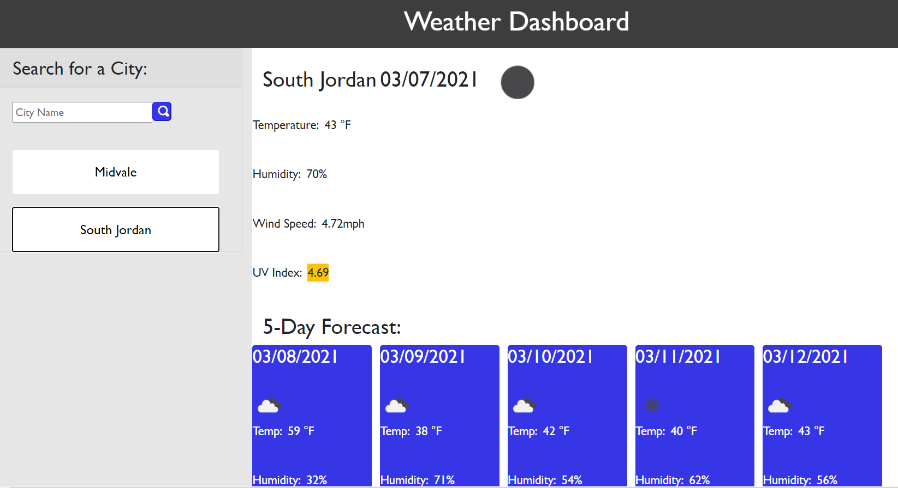

# Weather Dashboard
This application allows you to browse through any city's weather based on information provided by OpenWeather, and easily plan your trip accordingly!

## What to Expect
When you search for weather based on city, the current and future conditions are presented, and that city's name is added to the search history. When viewing current weather conditions, you will have access to all the typical information and icons you'd find on any weather application. You can view future conditions up to a 5-day forecast. You will be able to click through your search history to populate those same results again quickly.

https://savbennett8.github.io/weather-dashboard/

